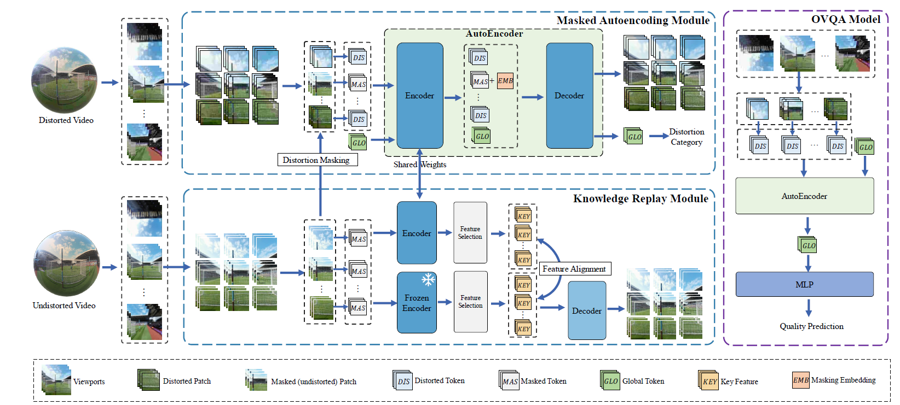

[](https://github.com/Aca4peop/CIQNet/blob/main/LICENSE](https://github.com/guyueyao/OmniVQA/blob/main/LICENSE)

#   Distortion-Sensitive Masked Autoencoder for Omnidirectional Video Quality Assessment



# Requirements

- [FFmpeg](http://ffmpeg.org/) version 4.4.3 or higher is required for video decoding.

- The following Python dependencies are recommended:

  ```
  torch
  torchvision
  timm
  scikit-video
  scikit-image
  tqdm
  numpy
  scipy
  einops
  decord
  ```

  

# Datasets

Click the hyper links to see the details of these datasets.

### 360 video datasets:

1. [ODV-VQA](https://github.com/Archer-Tatsu/VQA-ODV)

2. [JVQD](http://data.etrovub.be/qualitydb/judder-vqa/)

3. [SVQD](https://github.com/Telecommunication-Telemedia-Assessment/360_streaming_video_quality_dataset)


5-folds cross test was adopted in the experiment. Each dataset was split into non-overlapping five splits, each split has the similar distribution of qualities. See [datasets](./datasets/Readme.md) for more details.

# Usages

We provide a pre-trained weights of DS-MAE, which you can use it to build your own OVQA models.
See [Release Assets](https://github.com/guyueyao/OmniVQA/releases/tag/weights) to get the pre-trained weights.

## 1. Directly use

1. Command line

```bash
python OmniVQA.py test.mp4
```

2. Python

```python
from OmniVQA import inference
score=inference('test.mp4')
print(score)
```

The model was trained on the entire ODV-VQD database.


##  2. Intral-dataset evaluation

### 1. extract frame-level features

Run the CNNfeaturesptCMP.py

### 2. train and test model

Run the IntraDatasetsEval.py

## 3. Cross-dataset evaluation

### 1. extract frame-level features

Run the CNNfeaturesptCMP.py

### 2. train and test CIQNet

Run the CrossSetEval.py

## 4. Train DS-MAE
Our pre-train dataset is available at  https://pan.baidu.com/s/1yp6pDBMjcSxqfSoYNExWWQ?pwd=ta38 .
Run SSLTrain.py to pre-train DS-MAE.

# Contact

zyhu AT bit DOT edu DOT cn
